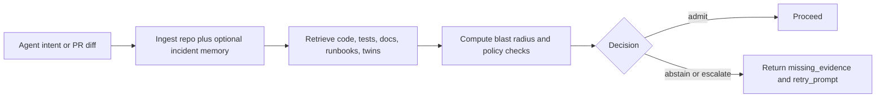

# Evidence Gate

Evidence Gate is an open-source reliability layer for AI agents. Before an
agent changes code, answers a repo question, or opens a PR, it checks whether
the action is supported by code, tests, docs, runbooks, and prior incidents or
PRs. If the evidence is weak, it blocks the action and returns machine-readable
`missing_evidence` so the next retry can repair the gap instead of shipping
tech debt.



## Why it exists

AI coding agents usually fail in the same predictable ways:

- they change code without updating the regression test that proves the change
- they ignore prior incidents, rollout guidance, or runbooks
- they open the wrong-file PR and still sound confident
- they give a human a warning instead of giving the next agent step a repair contract

Evidence Gate is trying to solve that narrower problem well.

## What ships today

- FastAPI service for `query`, `change-impact`, and `action` decisions
- MCP server for Cursor, Cline, and other agent clients
- GitHub and GitLab required-check wrappers for CI merge gates
- Next.js stakeholder dashboard for `Risk Avoided` and `Agent Healing Rate`
- live read-only connectors for GitHub, Jira, Confluence, Slack, and PagerDuty
- Tree-sitter JS or TS analysis plus optional LSIF or SCIP sidecars
- changed-path-aware test discovery to improve healing-loop success on real repos

## Quickstart

Install the package and dev dependencies:

```bash
python -m pip install -e '.[dev]'
```

Start the API:

```bash
uvicorn evidence_gate.api.main:app --app-dir app --reload
```

Ingest a repository and ask for an action decision:

```bash
curl -X POST http://127.0.0.1:8000/v1/knowledge-bases/ingest \
  -H "content-type: application/json" \
  -d '{"repo_path": "/path/to/repo"}'

curl -X POST http://127.0.0.1:8000/v1/decide/action \
  -H "content-type: application/json" \
  -d '{
    "repo_path": "/path/to/repo",
    "action_summary": "Review the auth/session change before merge.",
    "changed_paths": ["src/session.py"]
  }'
```

Run the dashboard:

```bash
cd dashboard
npm install
npm run dev
```

If you want the quickest public demo, run:

```bash
./scripts/run_demo_sandbox.sh
```

## Proof, not promises

| Signal | Current result |
| --- | --- |
| FastAPI structural benchmark | 84.00% binary accuracy, 0.00% false-admit |
| Poisoned corpus benchmark | 12.50% false-admit vs 87.50% lexical baseline |
| Mixed-source incident blocking | 80.00% block rate when incident evidence is present |
| SWE-bench Lite replay | 32.67% initial allow, 50.67% healed allow, +18.00 points |
| Wrong-file false-allow on SWE-bench decoys | 1.00% |

The most important current benchmark artifact is the 300-task SWE-bench Lite
replay. It shows that the gate can block incomplete patches, emit repair
guidance, and improve allow rate on retry without becoming a blanket allow.

## Read next

- [VISION.md](/sep/evidence-gate/VISION.md): what the product is and why it is not "just AI PR review"
- [GUIDES.md](/sep/evidence-gate/GUIDES.md): quickstart variants, MCP, CI, dashboard, connectors, and runbooks
- [API.md](/sep/evidence-gate/API.md): HTTP endpoints, MCP tools, and decision payloads
- [BENCHMARKS.md](/sep/evidence-gate/BENCHMARKS.md): results, artifact links, and reproduction commands

Operational runbooks stay separate because they are part of the evidence
surface:

- [live_connector_operations.md](/sep/evidence-gate/runbooks/live_connector_operations.md)
- [mcp_agent_troubleshooting.md](/sep/evidence-gate/runbooks/mcp_agent_troubleshooting.md)
- [required_check_operations.md](/sep/evidence-gate/runbooks/required_check_operations.md)

## Current limits

- The repo now supports CI gating, MCP healing loops, live connectors, and a stakeholder dashboard.
- It does not yet prove end-to-end solved-task uplift against a live framework such as OpenHands or SWE-agent.
- It does not yet ship multi-tenant auth, hosted sync, or a production SaaS control plane.

## Repo layout

- `app/`: service, retrieval, blast radius, MCP, and audit code
- `dashboard/`: stakeholder UI
- `runbooks/`: operational evidence the gate can cite
- `benchmarks/`: benchmark cases and result artifacts
- `scripts/`: local tooling, wrappers, and demo runners
